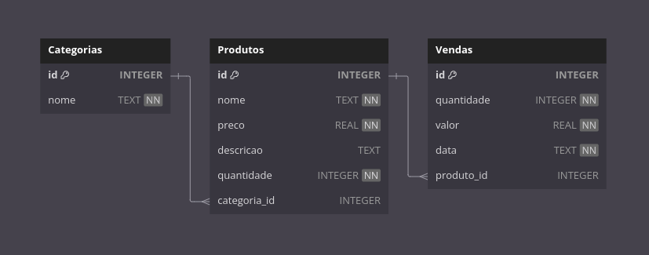
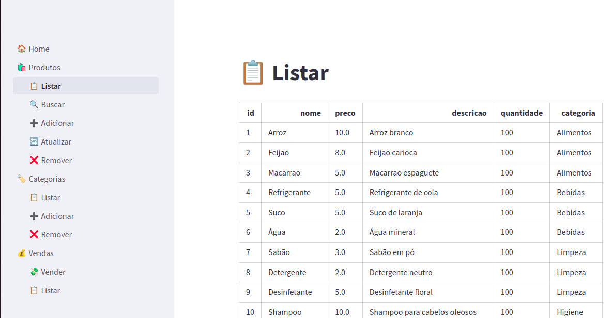

## Relatório do Trabalho - Sistema para supermercado

### Objetivo

O objetivo deste trabalho é aplicar os conceitos de programação orientada a
objetos e banco de dados para criar um sistema de gerenciamento de estoque.
Esse sistema deve ser capaz de armazenar e manipular informações sobre
produtos, categorias e vendas, permitindo uma gestão eficiente e organizada do estoque da empresa.

### Desenvolvimento

Modelagem do Banco de Dados
A modelagem do banco de dados foi realizada inicialmente para definir a estrutura do sistema
e as relações entre as entidades envolvidas. Foi utilizado o modelo entidade-relacionamento
(ER) para representar as entidades e seus atributos, bem como as relações entre elas.
As principais entidades identificadas foram:
- Categorias: representa as categorias de produtos disponíveis no estoque.
- Produtos: representa os produtos disponíveis para venda, com informações como nome,
preço, quantidade em estoque e categoria a que pertencem.
- Vendas: representa as vendas realizadas, com informações como data da venda e total
faturado.
A seguir, apresentamos o diagrama entidade-relacionamento (ER) que representa a modelagem
do banco de dados:



Implementação do Banco de Dados
Com base na modelagem realizada, o banco de dados foi implementado utilizando o sqlite3.
Foram criadas as tabelas correspondentes às entidades identificadas, com as devidas restrições
de chave primária, chave estrangeira e outros tipos de restrições necessárias para garantir a
integridade dos dados. A seguir, apresentamos um trecho do código SQL utilizado para criar
as tabelas:

```sql
CREATE TABLE categorias (
    id INTEGER PRIMARY KEY,
    nome TEXT NOT NULL
);

CREATE TABLE produtos (
    id INTEGER PRIMARY KEY,
    nome TEXT NOT NULL,
    preco REAL NOT NULL,
    quantidade INTEGER NOT NULL,
    categoria_id INTEGER,
    FOREIGN KEY (categoria_id) REFERENCES categorias(id)
);

CREATE TABLE vendas (
    id INTEGER PRIMARY KEY,
    data DATE NOT NULL,
    total REAL NOT NULL
);
```

### Consultas SQL

Consultas de Seleção
Foram desenvolvidas consultas SQL para recuperar informações específicas do banco de dados,
como listar todos os produtos, listar todas as categorias e listar todas as vendas realizadas.
A seguir, apresentamos um exemplo de consulta de seleção:

```sql
SELECT * FROM categorias;

SELECT produtos.*, categorias.nome AS categoria
FROM produtos
JOIN categorias ON produtos.categoria_id = categorias.id;

SELECT * FROM vendas;
```

### Classes e Métodos

Classes do Sistema
Para representar as entidades do sistema, foram criadas classes em Python correspondentes a
categorias, produtos e vendas. Cada classe possui atributos que representam os dados
necessários para cada entidade, bem como métodos para manipular esses dados.
A seguir, apresentamos um exemplo de classe em Python para representar a entidade de
produtos:

```python
class Produto:
    def __init__(self, id, nome, preco, descricao, quantidade, categoria_id):
        self.id = id
        self.nome = nome
        self.preco = preco
        self.descricao = descricao
        self.quantidade = quantidade
        self.categoria_id = categoria_id
```

Métodos de Manipulação de Dados
Foram implementados métodos para inserir, atualizar, recuperar e excluir dados do banco de
dados. Esses métodos foram desenvolvidos para cada classe do sistema, permitindo a
manipulação eficiente dos dados. A seguir, apresentamos um exemplo de método em Python para buscar um produto pelo seu id:

```python
@staticmethod
def buscar(id):
    conn = sqlite3.connect('./supermecado.db')
    conn.row_factory = sqlite3.Row
    cursor = conn.cursor()
    cursor.execute('SELECT * FROM produtos WHERE id = ?', (id,))
    produto = cursor.fetchone()
    conn.close()
    return Produto(*produto) if produto else None
```

### Interface de Usuário

Funcionalidades Implementadas
Foi desenvolvida uma interface de usuário simples em Python com a biblioteca Streamlit para
permitir a interação com o sistema de gerenciamento de estoque. A interface permite
visualizar, adicionar, editar e excluir produtos, categorias e vendas, facilitando a gestão do
estoque da empresa.

Exemplo de Interface de Usuário
A seguir, apresentamos um exemplo da interface de usuário desenvolvida:




### Considerações Finais

Resultados Obtidos
O sistema de gerenciamento de estoque desenvolvido atendeu aos objetivos propostos,
permitindo uma gestão eficiente e organizada do estoque da empresa. As funcionalidades de
CRUD foram implementadas com sucesso, facilitando a manipulação dos dados de produtos,
categorias e vendas. A interface de usuário desenvolvida torna o sistema acessível e intuitivo
para os usuários, proporcionando uma experiência agradável e eficiente.

Aprendizados
Durante o desenvolvimento deste trabalho, adquirimos conhecimentos importantes sobre
modelagem de banco de dados, programação orientada a objetos e desenvolvimento de
interfaces de usuário. A experiência de aplicar esses conceitos na prática foi enriquecedora e
nos proporcionou aprendizados valiosos para futuros projetos e desafios.

Recomendações Futuras
Para futuras melhorias no sistema de gerenciamento de estoque, recomendamos a aplicação de técnicas de validação de dados, mais reatividade na interface de usuário e a implementação de funcionalidades avançadas, como relatórios e dashboards.

### Auto-avaliação
O projeto atendeu aos objetivos propostos, proporcionando uma experiência de aprendizado
rica e desafiadora. A aplicação dos conceitos de programação orientada a objetos e banco de
dados foi fundamental para o desenvolvimento do sistema, que se mostrou eficiente e
funcional. Os aprendizados adquiridos durante este trabalho são valiosos e contribuirão para
nossos futuros projetos e desafios na área de tecnologia da informação.
